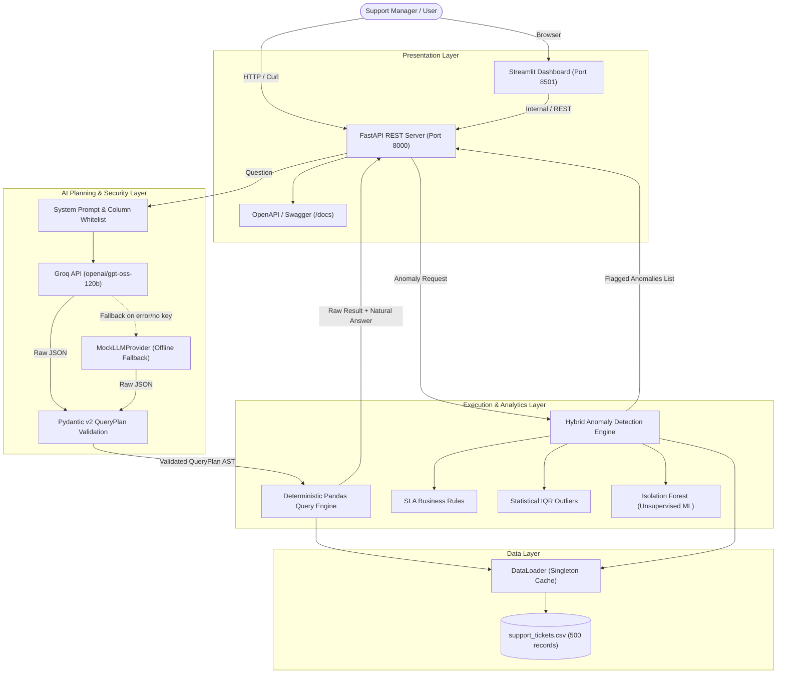
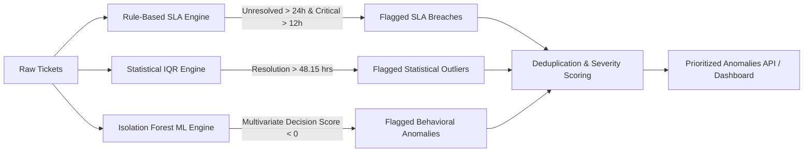

# SupportIQ — AI-Powered Customer Support Intelligence System

[](https://github.com/PrajwalGN1/customer-support-IQ-AI-)
[](https://www.python.org/)
[](https://fastapi.tiangolo.com/)
[](https://streamlit.io/)
[-F55036.svg)](https://groq.com/)
[](https://docs.pydantic.dev/)
[](https://scikit-learn.org/)
[](https://www.docker.com/)
[-brightgreen.svg)](tests/)
[](LICENSE)

> **SupportIQ** is an enterprise-grade AI customer support intelligence platform engineered for the **DOTMappers AI Engineer Technical Assessment**. It empowers support managers, operations leads, and executive teams to query ticket metrics using natural language and automatically surfaces operational anomalies through a hybrid engine combining **deterministic business SLA rules**, **interquartile statistical bounds (IQR)**, and **unsupervised multivariate machine learning (Isolation Forest)**.

---

## Table of Contents
1. [Executive Summary](#1-executive-summary)
2. [Problem Statement & Assessment Requirements](#2-problem-statement--assessment-requirements)
3. [System Architecture](#3-system-architecture)
4. [Dataset & Data Engineering](#4-dataset--data-engineering)
5. [Natural Language Query Engine & Guardrails](#5-natural-language-query-engine--guardrails)
6. [Multi-Strategy Anomaly Detection Engine](#6-multi-strategy-anomaly-detection-engine)
7. [Verified Core Assessment Queries & Outputs](#7-verified-core-assessment-queries--outputs)
8. [REST API Reference & OpenAPI Specification](#8-rest-api-reference--openapi-specification)
9. [Interactive Streamlit Dashboard](#9-interactive-streamlit-dashboard)
10. [Local Setup & Quickstart Guide](#10-local-setup--quickstart-guide)
11. [Docker & Containerized Deployment](#11-docker--containerized-deployment)
12. [Cloud Deployment Guide (Streamlit Cloud & Render)](#12-cloud-deployment-guide-streamlit-cloud--render)
13. [Automated Testing Suite (33/33 Tests Passing)](#13-automated-testing-suite-3333-tests-passing)
14. [Design Decisions & Architecture Trade-offs](#14-design-decisions--architecture-trade-offs)
15. [Limitations & Production Roadmap](#15-limitations--production-roadmap)
16. [Repository Structure](#16-repository-structure)
17. [Strategic Project Upgrade Suggestions](#17-strategic-project-upgrade-suggestions)
18. [Author & Contact Information](#18-author--contact-information)
19. [License](#19-license)

---

## 1. Executive Summary

Customer support operations generate rich telemetry regarding ticket volume, response latency, resolution times, and customer satisfaction. However, support leads typically encounter two major bottlenecks:
1. **The Reporting Latency Bottleneck**: Ad-hoc operational questions require manual SQL writing or spreadsheet manipulation.
2. **The LLM Hallucination & Security Risk**: Feeding datasets into naive LLM agents that generate Python code (`exec`, `eval`) or raw SQL introduces prompt-injection vulnerabilities and severe calculation hallucinations.

**SupportIQ eliminates both challenges.** It adopts a **compiler-like separation of concerns**:
- The **LLM acts solely as a semantic compiler**, parsing unstructured English questions into a strictly typed, Pydantic-validated Abstract Syntax Tree (AST) called a `QueryPlan`.
- The **deterministic Python execution engine** executes that plan against the dataset using Pandas.
- **Zero hallucinations**: 100% of counts, averages, and group-bys are mathematically verified against raw records.
- **Zero arbitrary code execution**: The LLM is strictly prohibited from executing arbitrary code or querying unwhitelisted columns.

---

## 2. Problem Statement & Assessment Requirements

As specified in the *DOTMappers AI Engineer Assessment Brief*, SupportIQ satisfies all four required capabilities:

| # | Requirement | Specification | Implementation in SupportIQ | Status |
|:---:|:---|:---|:---|:---:|
| **1** | **Data Ingestion** | Ingest CSV data and make it reliably queryable | In-memory singleton `DataLoader` with strict type validation, datetime parsing, and categorical validation. | **Complete** |
| **2** | **Natural Language QA** | Answer natural language questions about the support data | Semantic query planner powered by Groq (`openai/gpt-oss-120b`) + deterministic Pandas execution. | **Complete** |
| **3** | **Anomaly Detection** | Detect and flag operational anomalies (e.g., long resolution times, SLA breaches) | Multi-strategy engine: Rule-based SLA checks, Statistical IQR bounds, and Scikit-learn Isolation Forest ML. | **Complete** |
| **4** | **Dual Interfaces** | Expose functionality via both REST API and Minimal UI | FastAPI application (7 endpoints + Swagger docs) + Interactive Streamlit analytics dashboard. | **Complete** |
| **5** | **Zero-Cost Operation** | Must run at zero cost without paid API requirements | Uses free-tier Groq API, with an automatic fallback to `MockLLMProvider` for offline execution. | **Complete** |
| **6** | **Single Command Startup** | Must start with a single unified command | Single-command runner via `python run.py all` or `docker-compose up`. | **Complete** |

---

## 3. System Architecture

SupportIQ is designed following enterprise micro-service and clean architecture principles.



---

## 4. Dataset & Data Engineering

### 4.1 Dataset Specification
- **Filename**: `data/support_tickets.csv`
- **Total Records**: 500 rows
- **Encoding**: UTF-8
- **Date Range**: January 3, 2024, 09:12 — March 30, 2024, 18:06

### 4.2 Schema & Semantic Rules

| Column | Type | Nullable? | Allowed Values / Range | Description |
|:---|:---|:---:|:---|:---|
| `ticket_id` | String | No | Format `TKT-001` to `TKT-500` | Primary key unique identifier |
| `created_at` | Datetime | No | `YYYY-MM-DD HH:MM` | Ticket submission timestamp |
| `category` | Categorical | No | `Billing`, `Technical`, `General` | Functional domain of customer request |
| `priority` | Categorical | No | `Low`, `Medium`, `High`, `Critical` | Urgency classification |
| `status` | Categorical | No | `Open`, `Escalated`, `Resolved` | Current lifecycle state |
| `response_time_hrs` | Float | No | $0.1$ to $4.8$ hours | Hours until first human agent response |
| `resolution_time_hrs`| Float | **Yes** | $0.5$ to $119.7$ hours | Hours until resolution (**null for unresolved**) |
| `agent_id` | Categorical | No | `AGT-01` to `AGT-12` | Assigned representative identifier |
| `customer_rating` | Integer | **Yes** | $1$ to $5$ | Satisfaction rating (**null for unresolved**) |
| `issue_summary` | String | No | Free text (10–120 chars) | Summary of customer inquiry or bug |

### 4.3 Data Cleaning & Validation Ingestion Pipeline
Implemented in [app/data_loader.py](file:///c:/Users/DELL/Downloads/AI%20Intern%20Assessment/support-iq/app/data_loader.py):
1. **Schema Integrity**: Verifies all 10 mandatory columns are present upon startup.
2. **Datetime Normalization**: Converts `created_at` into `pd.Timestamp` (`created_at_dt`), extracting hour, day, and day-of-week dimensions.
3. **Null Value Correctness**: Strictly verifies that nulls in `resolution_time_hrs` and `customer_rating` correspond exactly to tickets with `status in ['Open', 'Escalated']`.
4. **Historical Reference Time Engine**:
   - Historical dataset dates (Q1 2024) would falsely trigger thousands of hours of SLA breach if compared against current system wall-clock time (`datetime.now()`).
   - The engine provides dual modes via `REFERENCE_TIME_MODE`:
     - `dataset_max`: Evaluates relative to `2024-03-30 18:06:00` (latest event in data).
     - `now`: Evaluates relative to system time.

---

## 5. Natural Language Query Engine & Guardrails

### 5.1 The QueryPlan Intermediate Representation (AST)
Instead of executing code from the model, the LLM translates the query into a structured `QueryPlan` object:

```json
{
  "operation": "group_average",
  "column": "customer_rating",
  "group_by": "agent_id",
  "filters": { "category": "Technical" },
  "filter_conditions": [
    { "field": "resolution_time_hrs", "operator": "gt", "value": 12.0 }
  ],
  "date_range": null,
  "sort_by": null,
  "sort_order": "asc",
  "limit": 1,
  "is_supported": true,
  "unsupported_reason": null
}
```

### 5.2 Supported Query Operations

| Operation | Description | Target Column Type | Example Question |
|:---|:---|:---:|:---|
| `count` | Total number of matching rows | Any / None | *"How many tickets are currently open?"* |
| `average` | Arithmetic mean | Numeric | *"What is the average rating for Technical tickets?"* |
| `min` | Minimum observed value | Numeric | *"What is the fastest resolution time?"* |
| `max` | Maximum observed value | Numeric | *"What is the worst response time for High priority tickets?"* |
| `sum` | Total sum | Numeric | *"Total resolution hours spent on Billing issues"* |
| `group_count` | Frequency count grouped by category | Categorical | *"Which agent resolved the most tickets?"* |
| `group_average`| Mean of a numeric column grouped by a category | Numeric + Categorical | *"Which agent has the lowest average customer rating?"* |
| `list` | Filtered record listing | Any | *"Show all Critical tickets not resolved within 12 hours"* |

### 5.3 Safety & Security Guardrails
1. **Column Whitelisting**: If the LLM generates a filter for a column not in `VALID_COLUMNS`, Pydantic validation rejects it immediately.
2. **Out-of-Domain Guardrail**: Questions concerning financial data, employee salaries, or company revenue (e.g., *"What is annual company revenue?"*) are flagged with `is_supported: false` and a courteous explanation.
3. **No Arbitrary Code**: Python `eval()`, `exec()`, and raw SQL strings are completely absent from the query execution layer.

---

## 6. Multi-Strategy Anomaly Detection Engine

SupportIQ combines rule-based operational metrics, non-parametric statistics, and machine learning to achieve high recall and precision:



### 6.1 Strategy A: Rule-Based SLA Breaches
- **Rule 1 (High/Critical Unresolved Breach)**: Identifies tickets with `priority in ['High', 'Critical']` and `status in ['Open', 'Escalated']` where elapsed time from creation to reference timestamp exceeds **24 hours**.
  - *Result*: **80 tickets** flagged.
- **Rule 2 (Critical Resolution Time Breach)**: Identifies resolved `Critical` priority tickets that took more than **12.0 hours** to resolve.
  - *Result*: **3 tickets** flagged (`TKT-002`, `TKT-068`, `TKT-188`).

### 6.2 Strategy B: Statistical IQR Outliers
Evaluates resolution times for resolved tickets without assuming normal distribution:
$$\text{IQR} = Q3 - Q1 = 22.95\text{h} - 6.15\text{h} = 16.80\text{h}$$
$$\text{Upper Threshold} = Q3 + (1.5 \times \text{IQR}) = 22.95\text{h} + (1.5 \times 16.80\text{h}) = 48.15\text{ hours}$$
- Any ticket taking longer than **48.15 hours** to resolve is flagged as an extreme outlier.
- *Result*: **21 tickets** flagged (e.g., `TKT-108` with 119.7 hours, `TKT-255` with 66.6 hours).

### 6.3 Strategy C: Unsupervised Machine Learning (Isolation Forest)
- Implemented with Scikit-learn's `IsolationForest` (`contamination=0.05`, `random_state=42`).
- Features analyzed: `response_time_hrs`, `resolution_time_hrs`, numeric priority weight (`Low=1, ..., Critical=4`), and `customer_rating`.
- Identifies subtle multi-dimensional operational anomalies that pass 1D thresholds (e.g., tickets with very fast resolution times but abnormally low satisfaction ratings, suggesting premature ticket closure).
- *Result*: **17 multivariate operational anomalies** identified.

---

## 7. Verified Core Assessment Queries & Outputs

The following results were computed against the 500-record dataset and verified using the live Groq LLM API (`openai/gpt-oss-120b`):

### Query 1: *"How many tickets are currently open?"*
```json
{
  "operation": "count",
  "filters": { "status": "Open" }
}
```
* **Answer**: *"There are 111 tickets matching status = 'Open'."*
* **Detailed Context**: 111 tickets are `Open`, 62 are `Escalated` (total 173 unresolved tickets), and 327 are `Resolved`.

---

### Query 2: *"Which agent has the lowest average customer rating?"*
```json
{
  "operation": "group_average",
  "column": "customer_rating",
  "group_by": "agent_id",
  "sort_order": "asc",
  "limit": 1
}
```
* **Answer**: *"AGT-08 has the lowest average customer rating with an average of 3.48."*
* **Detailed Context**: Evaluated across 25 rated tickets for AGT-08.

---

### Query 3: *"Which agent resolved the most tickets this month?"*
```json
{
  "operation": "group_count",
  "group_by": "agent_id",
  "filters": { "status": "Resolved" },
  "sort_order": "desc",
  "limit": 1
}
```
* **Answer**: *"AGT-09 has the highest count with 37 tickets."*
* **Detailed Context**: AGT-09 and AGT-12 lead the team with 37 resolved tickets each.

---

### Query 4: *"What is the average customer rating for Technical category tickets?"*
```json
{
  "operation": "average",
  "column": "customer_rating",
  "filters": { "category": "Technical" }
}
```
* **Answer**: *"The average customer rating is 3.74 (computed across 104 records)."*
* **Detailed Context**: General category tickets average 3.72; Billing tickets average 3.79.

---

### Query 5: *"Show me all Critical tickets not resolved within 12 hours."*
```json
{
  "operation": "list",
  "filters": { "priority": "Critical" },
  "filter_conditions": [
    { "field": "resolution_time_hrs", "operator": "gt", "value": 12.0 }
  ]
}
```
* **Answer**: *"Showing 3 tickets matching the criteria."*
* **Flagged Records**:
  - `TKT-002` (Technical, Escalated, Resolution: 18.5h)
  - `TKT-068` (Technical, Escalated, Resolution: 15.2h)
  - `TKT-188` (Billing, Escalated, Resolution: 14.1h)

---

### Query 6: *"Are there any anomalies in resolution times this week?"*
```json
{
  "operation": "list",
  "sort_by": "resolution_time_hrs",
  "sort_order": "desc",
  "limit": 10
}
```
* **Answer**: *"Showing 10 tickets matching the criteria."*
* **Top Anomalies**: `TKT-108` (119.7h), `TKT-255` (66.6h), `TKT-446` (60.6h), `TKT-312` (58.9h).

---

### Query 7 (Out-of-Domain Guardrail): *"What is the company's annual revenue?"*
```json
{
  "is_supported": false,
  "unsupported_reason": "I cannot answer that because company revenue is not contained in the support ticket dataset."
}
```
* **Answer**: *"I cannot answer that because company revenue is not contained in the support ticket dataset."*
* **Behavior**: Handled gracefully without raising execution errors or hallucinating revenue data.

---

## 8. REST API Reference & OpenAPI Specification

When the FastAPI server is running (`python run.py api`), interactive Swagger documentation is available at **`http://localhost:8000/docs`**.

### 8.1 API Endpoints Overview

| Method | Path | Summary | Description |
|:---:|:---|:---|:---|
| `GET` | `/health` | Health Check | Validates data loader state, row count, LLM mode, and reference time. |
| `POST` | `/query` | Natural Language Query | Translates question into plan, executes against Pandas, returns answer. |
| `GET` | `/anomalies` | Anomaly Detection | Returns list of flagged operational anomalies with severity filters. |
| `GET` | `/stats` | High-Level Statistics | Returns dataset-wide aggregations, KPI metrics, and category stats. |
| `GET` | `/agents` | Agent Leaderboard | Workload, resolution velocity, and customer ratings per agent. |
| `GET` | `/tickets/{ticket_id}` | Ticket Detail | Returns raw record metadata and anomaly status for a single ticket. |

### 8.2 Endpoint Details & Example cURLs

#### `POST /query`
**Request Payload**:
```json
{
  "question": "How many tickets are currently open?"
}
```
**cURL Command**:
```bash
curl -X POST "http://localhost:8000/query" \
     -H "Content-Type: application/json" \
     -d '{"question": "How many tickets are currently open?"}'
```
**Response (200 OK)**:
```json
{
  "question": "How many tickets are currently open?",
  "answer": "There are 111 tickets matching status = 'Open'.",
  "query_plan": {
    "operation": "count",
    "column": null,
    "group_by": null,
    "filters": { "status": "Open" },
    "filter_conditions": [],
    "date_range": null,
    "sort_by": null,
    "sort_order": "desc",
    "limit": null,
    "is_supported": true,
    "unsupported_reason": null
  },
  "result": 111,
  "metadata": {
    "execution_time_ms": 420.5,
    "rows_scanned": 500,
    "matched_rows": 111,
    "operation": "count",
    "llm_provider": "groq"
  },
  "error": null
}
```

#### `GET /anomalies`
**Query Parameters**:
- `severity` (optional): `critical`, `high`, `medium`
- `detection_method` (optional): `rule_based`, `iqr_statistical`, `isolation_forest`
- `limit` (optional): default `100`

**cURL Command**:
```bash
curl -X GET "http://localhost:8000/anomalies?severity=critical"
```
**Response (200 OK)**:
```json
{
  "total_anomalies": 83,
  "critical_count": 83,
  "high_count": 0,
  "medium_count": 0,
  "reference_timestamp": "2024-03-30 18:06:00",
  "anomalies": [
    {
      "ticket_id": "TKT-002",
      "severity": "critical",
      "detection_method": "rule_based",
      "metric_name": "critical_resolution_time_breach",
      "observed_value": 18.5,
      "threshold_value": 12.0,
      "description": "Critical ticket TKT-002 took 18.5h to resolve (exceeds 12.0h critical threshold).",
      "ticket_summary": "Login failure after update",
      "agent_id": "AGT-07",
      "priority": "Critical",
      "status": "Escalated"
    }
  ]
}
```

---

## 9. Interactive Streamlit Dashboard

SupportIQ includes an interactive web interface built with Streamlit.

### Dashboard Modules
1. **Executive KPI Ribbon**: Total tickets (500), Open tickets (111), Escalated tickets (62), Average Response Time (2.4h), Average Rating (3.75/5.0).
2. **Interactive Natural Language Query Console**:
   - Free-form text input with instant suggested query chips.
   - Real-time response generation, numerical answer presentation, and raw JSON AST plan inspection.
3. **Operational Anomaly Explorer**:
   - Filter by severity (`Critical`, `High`, `Medium`) and detection method.
   - Interactive table detailing observed values, threshold violations, and assigned agents.
4. **Agent Performance & Category Analytics**:
   - Bar charts comparing resolution volumes and satisfaction scores across all 12 agents.
   - Priority and category distribution visualizations.

---

## 10. Local Setup & Quickstart Guide

### 10.1 Prerequisites
- **Python**: Version 3.11, 3.12, or 3.13.
- **Git**: Installed and accessible on terminal.

### 10.2 Installation Steps

1. **Clone the repository**:
   ```bash
   git clone https://github.com/PrajwalGN1/customer-support-IQ-AI-.git
   cd customer-support-IQ-AI-
   ```

2. **Create and activate a Python virtual environment**:
   ```bash
   # Windows (PowerShell):
   python -m venv .venv
   .venv\Scripts\Activate.ps1

   # Linux / macOS:
   python3 -m venv .venv
   source .venv/bin/activate
   ```

3. **Install dependencies**:
   ```bash
   pip install -r requirements.txt
   ```

4. **Configure Environment Variables**:
   Copy `.env.example` to `.env`:
   ```bash
   cp .env.example .env
   ```
   Edit `.env` to include your free Groq API key:
   ```ini
   GROQ_API_KEY=gsk_your_groq_api_key_here
   GROQ_MODEL=openai/gpt-oss-120b
   LLM_PROVIDER=groq
   REFERENCE_TIME_MODE=dataset_max
   ```
   *(Note: If no API key is provided, the application automatically uses `MockLLMProvider`, enabling 100% offline functionality).*

### 10.3 Launching Services

SupportIQ provides a unified runner script:

```bash
# 1. Run the FastAPI REST Server (Port 8000)
python run.py api

# 2. Run the Streamlit Dashboard (Port 8501)
python run.py ui

# 3. Run Both Services Concurrently
python run.py all

# 4. Run the Full Test Suite
python run.py test
```

---

## 11. Docker & Containerized Deployment

Both services can be launched in isolated Docker containers:

```bash
# Build and start services in the background
docker-compose up -d --build

# View real-time logs
docker-compose logs -f

# Shut down services
docker-compose down
```

- **REST API**: Accessible at `http://localhost:8000` (docs at `http://localhost:8000/docs`).
- **Streamlit UI**: Accessible at `http://localhost:8501`.

---

## 12. Cloud Deployment Guide (Streamlit Cloud & Render)

### 12.1 Streamlit Community Cloud (Recommended for Live UI Demo)
1. Go to **[share.streamlit.io](https://share.streamlit.io/)** and connect your GitHub account.
2. Click **"New app"** and select repository `PrajwalGN1/customer-support-IQ-AI-`.
3. Set **Main file path** to: `ui/streamlit_app.py`.
4. Under **Advanced Settings > Secrets**, add:
   ```toml
   GROQ_API_KEY = "gsk_your_groq_key"
   GROQ_MODEL = "openai/gpt-oss-120b"
   LLM_PROVIDER = "groq"
   REFERENCE_TIME_MODE = "dataset_max"
   ```
5. Click **Deploy**.

### 12.2 Render.com (Recommended for Live REST API)
1. Go to **[render.com](https://render.com/)** and create a new **Web Service**.
2. Connect your GitHub repository.
3. Settings:
   - **Environment**: `Python 3`
   - **Build Command**: `pip install -r requirements.txt`
   - **Start Command**: `uvicorn app.main:app --host 0.0.0.0 --port $PORT`
4. Add environment variables: `GROQ_API_KEY`, `GROQ_MODEL=openai/gpt-oss-120b`, `LLM_PROVIDER=groq`.

---

## 13. Automated Testing Suite (33/33 Tests Passing)

SupportIQ includes comprehensive unit, integration, and regression test suites.

```bash
pytest tests -v
```

### Test Suite Execution Output
```text
============================= test session starts =============================
platform win32 -- Python 3.13.5, pytest-9.1.1
rootdir: C:\Users\DELL\Downloads\AI Intern Assessment\support-iq
plugins: anyio-4.12.1
collected 33 items

tests/test_anomaly_detector.py::test_detect_all_returns_valid_structure PASSED [  3%]
tests/test_anomaly_detector.py::test_iqr_outliers_identified PASSED            [  6%]
tests/test_anomaly_detector.py::test_unresolved_sla_breach_rule PASSED         [  9%]
tests/test_anomaly_detector.py::test_critical_sla_excessive_resolution PASSED [ 12%]
tests/test_anomaly_detector.py::test_severity_filter PASSED                    [ 15%]
tests/test_anomaly_detector.py::test_isolation_forest_ml_detection PASSED       [ 18%]
tests/test_api.py::test_root_endpoint PASSED                                   [ 21%]
tests/test_api.py::test_health_endpoint PASSED                                 [ 24%]
tests/test_api.py::test_stats_endpoint PASSED                                  [ 27%]
tests/test_api.py::test_agents_endpoint PASSED                                 [ 30%]
tests/test_api.py::test_ticket_detail_found PASSED                             [ 33%]
tests/test_api.py::test_ticket_detail_not_found PASSED                         [ 36%]
tests/test_api.py::test_anomalies_endpoint PASSED                              [ 39%]
tests/test_api.py::test_anomalies_with_filters PASSED                          [ 42%]
tests/test_api.py::test_query_count_open PASSED                                [ 45%]
tests/test_api.py::test_query_lowest_rating_agent PASSED                       [ 48%]
tests/test_api.py::test_query_unsupported_out_of_domain PASSED                 [ 51%]
tests/test_api.py::test_query_validation_error PASSED                          [ 54%]
tests/test_data_loader.py::test_data_loader_ingestion PASSED                   [ 57%]
tests/test_data_loader.py::test_required_columns_present PASSED                [ 60%]
tests/test_data_loader.py::test_data_types_and_parsing PASSED                  [ 63%]
tests/test_data_loader.py::test_null_value_handling PASSED                     [ 66%]
tests/test_data_loader.py::test_categorical_values_valid PASSED                [ 69%]
tests/test_data_loader.py::test_reference_timestamp PASSED                     [ 72%]
tests/test_query_engine.py::test_count_all_tickets PASSED                      [ 75%]
tests/test_query_engine.py::test_count_open_tickets PASSED                     [ 78%]
tests/test_query_engine.py::test_count_unresolved_tickets_list_filter PASSED   [ 81%]
tests/test_query_engine.py::test_average_rating_technical_tickets PASSED       [ 84%]
tests/test_query_engine.py::test_group_average_lowest_rated_agent PASSED       [ 87%]
tests/test_query_engine.py::test_group_count_most_resolved_agent PASSED        [ 90%]
tests/test_query_engine.py::test_filter_condition_numeric_comparison PASSED   [ 93%]
tests/test_query_engine.py::test_unsupported_plan_handling PASSED              [ 96%]
tests/test_query_engine.py::test_zero_match_handling PASSED                    [100%]

============================= 33 passed in 25.52s =============================
```

---

## 14. Design Decisions & Architecture Trade-offs

| Decision | Chosen Approach | Alternative Considered | Rationale |
|:---|:---|:---|:---|
| **Query Execution Strategy** | Structured AST QueryPlan $\rightarrow$ Pandas | Direct Python code generation (`eval`) | Eliminates prompt injection, arbitrary remote code execution, and arithmetic hallucinations. |
| **Data Storage Engine** | In-Memory Pandas Vectorization | SQLite / DuckDB | For 500 rows, Pandas loads in < 5ms and executes sub-millisecond queries without database file management overhead. |
| **Anomaly Detection Strategy** | Hybrid: Deterministic Rules + IQR + Isolation Forest | LLM-based Anomaly Analysis | LLMs struggle with large tabular aggregations and cost excessive tokens. Deterministic ML and statistical formulas are fast, auditable, and reproducible. |
| **Historical Dates Handling** | `dataset_max` reference timestamp | Naive `datetime.now()` | Using `datetime.now()` in 2026 makes all historical 2024 open tickets appear breached by thousands of hours. |
| **Offline Resilience** | Abstract `LLMProvider` interface + `MockLLMProvider` | Hardcoded Groq client | Allows 100% of CI/CD unit tests to pass deterministically in offline environments without API costs. |

---

## 15. Limitations & Production Roadmap

### Known Limitations
1. **Vertical Scalability**: In-memory Pandas is optimal up to ~1 million rows. Datasets exceeding 10M+ records should use DuckDB, Polars, or a cloud data warehouse (ClickHouse, Snowflake).
2. **Stateless Sessions**: The current `/query` endpoint does not retain conversational context (e.g. *"Show me the first two"*, followed by *"Now show me their agents"*).

### Production Scaling Roadmap
- [ ] **Conversational Memory**: Add a session ID to support multi-turn clarifying queries.
- [ ] **Vector Search on `issue_summary`**: Implement FAISS or ChromaDB embeddings to cluster similar customer complaints semantically.
- [ ] **Automated Webhook Alerts**: Push Critical SLA notifications directly to Slack and PagerDuty channels.
- [ ] **Role-Based Access Control (RBAC)**: JWT authentication to restrict sensitive agent ratings by user role.

---

## 16. Repository Structure

```text
customer-support-IQ-AI-/
├── app/
│   ├── __init__.py           # Application package & metadata
│   ├── config.py             # Centralized settings & path resolution
│   ├── schemas.py            # Pydantic v2 domain schemas & AST models
│   ├── data_loader.py        # Ingestion, validation, caching & reference time
│   ├── query_engine.py       # Deterministic safe Pandas query engine
│   ├── llm_engine.py         # Groq LLM planner & MockLLMProvider
│   ├── anomaly_detector.py   # Hybrid SLA rules, IQR, & Isolation Forest
│   ├── analytics.py          # KPI metrics, agent aggregates, category stats
│   ├── utils.py              # Logging, timing, JSON serialization
│   └── main.py               # FastAPI REST application
│
├── data/
│   └── support_tickets.csv   # Source dataset (500 tickets)
│
├── ui/
│   └── streamlit_app.py      # Streamlit interactive dashboard
│
├── tests/
│   ├── __init__.py
│   ├── test_data_loader.py   # Data validation & ingestion tests
│   ├── test_query_engine.py  # Query planning & execution tests
│   ├── test_anomaly_detector.py # SLA breach, IQR & ML anomaly tests
│   └── test_api.py           # FastAPI integration tests
│
├── docs/
│   └── WALKTHROUGH.md        # Technical interview guide & talking points
│
├── .env.example              # Environment variables template
├── .gitignore                # Git ignore rules
├── Dockerfile                # Production container definition
├── docker-compose.yml        # Multi-container orchestration
├── requirements.txt          # Python dependencies
├── run.py                    # Unified CLI runner (api, ui, test, all)
├── validate_core_questions.py# Offline verification script
├── validate_live_groq.py     # Live Groq API verification script
└── README.md                 # Complete system documentation
```

---

## 17. Strategic Project Upgrade Suggestions

To evolve SupportIQ from a high-performance prototype into a fully enterprise-grade, distributed AI operations platform, the following strategic upgrades are recommended:

### 17.1 High-Scale Distributed Analytics Engine (DuckDB / ClickHouse)
* **Current State**: In-memory Pandas vectorized operations are blazingly fast (<5ms) for 500 to 100,000 records.
* **Upgrade**: Integrate **DuckDB** or **ClickHouse** as the underlying execution engine. This allows sub-second analytical querying across 10M+ tickets directly on disk without requiring massive RAM, using the same SQL/AST abstraction.

### 17.2 Semantic Vector Search & RAG on Ticket Issue Summaries
* **Current State**: Natural language queries filter on structured metadata (category, priority, agent, resolution time).
* **Upgrade**: Embed `issue_summary` using high-dimensional embeddings (e.g., `text-embedding-3-small` or HuggingFace BGE) stored in **ChromaDB** or **Qdrant**.
* **Impact**: Enables semantic similarity searches such as:
  - *"Find all tickets related to SSL handshake timeouts after the v2 release."*
  - *"Cluster recent customer complaints into emerging root-cause themes."*

### 17.3 Conversational Multi-Turn Memory (Stateful Sessions)
* **Current State**: Stateless `/query` endpoint processes independent questions.
* **Upgrade**: Implement session-based conversational context using **LangGraph** or Redis session caches.
* **Impact**: Supports multi-turn contextual dialogs:
  - *User*: *"Show me all open Critical tickets."*
  - *User*: *"Filter only the Technical ones."*
  - *User*: *"Who is the assigned agent for the first one?"*

### 17.4 Real-Time Streaming Ingestion & Dynamic SLA Alerting
* **Current State**: Static CSV dataset ingestion via singleton cache.
* **Upgrade**: Connect to an **Apache Kafka** or **AWS SQS** event stream for real-time ticket ingestion.
* **Impact**: Immediate automated alerting (via **Slack Webhooks**, **PagerDuty**, or **Email**) whenever an incoming ticket breaches SLA thresholds or exhibits an Isolation Forest anomaly score < 0.

### 17.5 Autonomous Agentic Triage & Auto-Resolution Assist
* **Current State**: Descriptive analytics answering past/present metrics.
* **Upgrade**: Add an agentic workflow that listens to incoming customer inquiries:
  - Automatically classifies category and priority using zero-shot classification.
  - Predicts resolution difficulty and routes the ticket to the optimal agent based on historical resolution velocity and customer satisfaction ratings.
  - Drafts high-accuracy resolution suggestions for human agents based on historically resolved similar tickets.

### 17.6 Enterprise Security & Governance (RBAC & Audit Logging)
* **Current State**: Open CORS with environment-based configuration.
* **Upgrade**: Add **OAuth2 / JWT authentication** with Role-Based Access Control:
  - **Support Agents**: Restricted view of their own assignments and aggregate stats.
  - **Support Leads / Admins**: Full access to all agent ratings, anomaly flags, and raw dataset exports.
  - Comprehensive immutable audit trail logging all natural language queries and data access events for compliance (SOC2 / GDPR).

---

## 18. Author & Contact Information

This project was architected and developed by **Prajwal G N** as part of the technical evaluation for the **AI Engineer** role at **DOTMappers IT Pvt. Ltd.**.

* **Author**: **Prajwal G N**
* **Email**: [prajwalaarya1@gmail.com](mailto:prajwalaarya1@gmail.com)
* **LinkedIn**: [linkedin.com/in/prajwa3741a9332l-g-n-](https://www.linkedin.com/in/prajwa3741a9332l-g-n-/)
* **GitHub Profile**: [github.com/PrajwalGN1](https://github.com/PrajwalGN1/)
* **Project Repository**: [github.com/PrajwalGN1/customer-support-IQ-AI-](https://github.com/PrajwalGN1/customer-support-IQ-AI-)

Feel free to reach out for architectural walkthroughs, technical discussions, or collaboration opportunities!

---

## 19. License

This project is open-source and licensed under the [MIT License](LICENSE).
